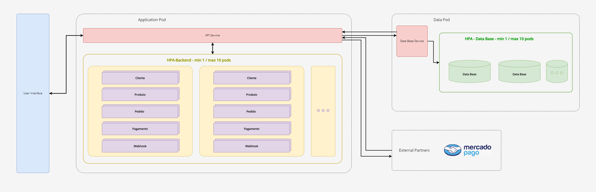

# Controle de Pedidos

Este repositório contém as atividades (Tech Challenge) da Pós Graduação em Arquitetura de Software.

## Autores

- [Adriano Morgon Arruda](https://github.com/adrianomorgon)
- [Flávio Roberto Teixeira](https://github.com/FlavioRoberto)

## Tecnologias Utilizadas

- .NET 7
- Entity Framework Core
- Swagger
- PostgreSQL
- Docker
- Kubernets

## Documentação

- [Domain Event Storming](https://www.figma.com/board/fHGDc1i4RxCmrrsPomCD4E/Domain-Event-Storming-Tech-Challenge?node-id=0%3A1&t=TI5wBxdhle65UPSn-1): Este link direciona para o Domain Event Storming, fornecendo uma visão geral visual do projeto.
- [Linguagem Ubíqua](https://endurable-saguaro-cb6.notion.site/Tech-challenge-819953d402a349e88708f15e7589e03a): A Linguagem Ubíqua é essencial para o entendimento compartilhado entre todas as partes interessadas, fornecendo um glossário de termos comuns utilizados no projeto.
- [Requisitos de Negócio](https://equable-windflower-bb5.notion.site/Documento-de-Requisitos-de-Neg-cio-15fe11dde1a8412e81d13facedf6f227): Os Requisitos de Negócio são essenciais para o entendimento do escopo do projeto, fornecendo uma visão geral dos requisitos funcionais e não funcionais.
- Collection: A collection do postman está localizada na pasta docs/collection

## Desenho de Arquitetura


## Execução do projeto com Kubernetes (K8S)

### Helm

Para instalar o projeto usando Helm, siga estes passos:

1. Navegue até a pasta `infra/helm` do seu projeto.

2. Execute o seguinte comando, especificando o diretório onde os arquivos do banco estão localizados. Por exemplo, se os arquivos do banco estão em `/Users/seu-usuario/banco-dados`:

   ```bash
   helm install controle-pedidos ./controlepedidos-chart --set database.deployment.volume.localPath="/Users/seu-usuario/banco-dados"
   ```
Certifique-se de substituir "/Users/seu-usuario/banco-dados" pelo caminho real onde os arquivos do banco de dados estão armazenados isso é importante pois internamente é utilizado o volume com storage class do tipo local-storage.

#### Integração com mercado pago: 
Para que a integração com o mercado pago ocorra é necessário especificar o token de integração  em base64 e a url de webhook ao levantar a aplicação para isso execute o seguinte comando:

   ```bash
   helm install controle-pedidos ./controlepedidos-chart --set database.deployment.volume.localPath="/Users/seu-usuario/banco-dados" --set mercadoPagoIntegration.token="Bearer TOKEN" --set mercadoPagoIntegration.urlWebhook="URL webhook"
   ```

Caso o token seja de uma conta de teste é importante destacar que ele só funcionará de segunda a sexta, pois o mercado pago desliga os servidores de testes aos finais de semana.

Caso queira disponibilizar um dns na cloud apontando pra sua url local você pode utilizar o [ngrok](https://ngrok.com/docs), com essa ferramenta é possível validar a integração do webhook sem a necessidade de pulicar o projeto em alguma cloud.

Após levantar a aplicação acesse a url `http://localhost:32000/swagger`

## Execução do projeto utilizando docker

Para executar o projeto, siga estas etapas:

1. Navegue até a pasta `src/app/ControlePedido`.
2. Execute o comando `docker compose up -d`.

Após levantar os containers, acesse a interface do Swagger para explorar a documentação das rotas da API. Para fazer isso, digite `https://localhost:5001/swagger` na barra de endereço do seu navegador.

## Gerando Migrations

Para gerar migrations, siga estas instruções:

1. Navegue até a pasta `src/app/ControlePedido`.
2. Execute o seguinte comando no terminal, substituindo `{NomeDaMigration}` pelo nome desejado para a migração:

```bash
dotnet ef migrations add {NomeDaMigration} --project Adapter/Driven/ControlePedido.Infra -s Adapter/Driver/ControlePedido.Api -c ControlePedidoContext --verbose
```

## Gerando Relatórios de Testes

Para gerar relatórios de testes com cobertura de código, siga estas instruções:

1. Execute os testes com cobertura de código usando o seguinte comando no terminal:

```bash
dotnet test /p:CollectCoverage=true --verbose
```

Isso executará os testes e gerará um relatório de cobertura de código no formato padrão.

Após a execução dos testes, gere o relatório de cobertura usando o seguinte comando no terminal:

```bash
reportgenerator -reports:coverage.opencover.xml -targetdir:Coveragereport -reporttypes:Html
```

Isso gerará um relatório HTML de cobertura de código no diretório Coveragereport.

Abra o arquivo index.html dentro da pasta Coveragereport para visualizar o relatório de cobertura gerado.

